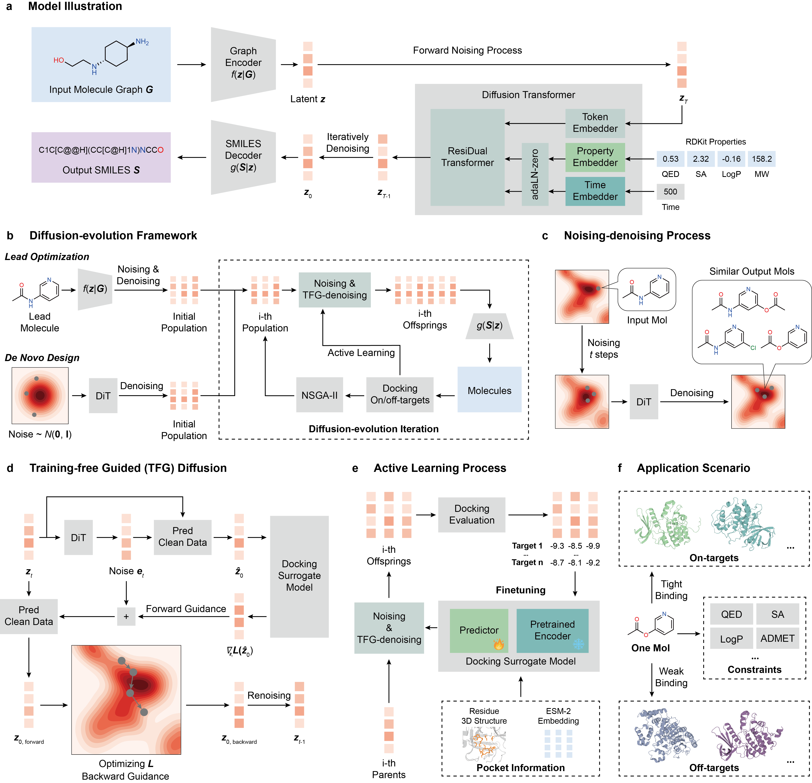

# MolSculptor
This is the github repo for the paper *MolSculptor: an adaptive diffusion-evolution framework enabling generative drug design for multi-target affinity and selectivity*, which is preprinted at [ChemRxiv](https://doi.org/10.26434/chemrxiv-2025-v4758).

<p align="center"></p>

## Installation
Running example scripts in [cases](./cases) requires:
* python==3.12
* jax==0.4.28, jaxlib==0.4.28
* flax==0.8.3
* ml-collections==0.1.1
* rdkit==2023.9.6
* openbabel-wheel==3.1.1
* meeko==0.6.1

We also provide [requirements.txt](./requirements.txt) to make sure you can quickly create a compatible environment by the following steps:
```
conda create -n molsculptor_env python=3.12
conda activate molsculptor_env
pip install -r requirements.txt
```
Our configuration includes Ubuntu 22.04 (GNU/Linux x86_64), NVIDIA A100-SXM4-80GB, CUDA 12.2 and Anaconda 24.9.1.

Next, you need to install [DSDP](https://github.com/PKUGaoGroup/DSDP), a GPU-accelerated tool for molecular docking:
```
cd dsdp
git clone https://github.com/PKUGaoGroup/DSDP.git DSDP_main
cd DSDP_main/DSDP_redocking/
make
cp DSDP ../../
cd ../../../
```
Successful compilation requires a working CUDA installation with correctly configured environment variables.

Finally, download the pre-trained model parameters:
```
mkdir checkpoints
wget -O checkpoints/auto_encoder/params.pkl https://zenodo.org/records/17016634/files/auto_encoder_config.pkl
wget -O checkpoints/auto_encoder/config.pkl https://zenodo.org/records/17016634/files/auto_encoder_params.pkl
wget -O checkpoints/diffusion_transformer/config.pkl https://zenodo.org/records/17016634/files/diffusion_transformer_config.pkl
wget -O checkpoints/diffusion_transformer/params.pkl https://zenodo.org/records/17016634/files/diffusion_transformer_params.pkl
wget -O checkpoints/affinity_predictor/config.pkl https://zenodo.org/records/17016634/files/affinity_predictor_config.pkl
wget -O checkpoints/affinity_predictor/params.pkl https://zenodo.org/records/17016634/files/affinity_predictor_params.pkl

```

The download may take 30-60 minutes depending on your connection speed.
## Molsculptor's current capabilities
The test cases in our paper are saved in [cases](./cases):
### Dual-target inhibitor lead optimization
We tested the molecular optimization capability for MolSculptor in three dual-target inhibitor design tasks:
* c-Jun N-terminal kinase 3 and Glycogen synthase kinase-3 beta (JNK3/GSK3beta)
```
bash cases/case_jnk3_gsk3b/opt.sh <seed> <gpu_id>
```
* Androgen receptor and glucocorticoid receptor (AR/GR)
```
bash cases/case_ar-gr/opt.sh <seed> <gpu_id>
```
* Soluble epoxide hydrolase and fatty acid amide hydrolase (sEH/FAAH)
```
bash cases/case_seh-faah/opt.sh <seed> <gpu_id>
```
### BIKE/MPSK1 selective inhibitor lead optimization
```
bash cases/case_bike_mpsk1/opt.sh <seed> <gpu_id>
```
### PI3K selective inhibitor *de novo* design
```
bash cases/case_pi3k/denovo.sh <seed> <gpu_id>
```
The runtime is approximately 12 hours for optimization cases and 24 hours for PI3K de novo design case. 
### How to build your own case
#### Lead optimization
For lead optimization tasks, you will need:
* `.pdbqt` files for target proteins.
* DSDP docking scripts for each target.
* An initial molecule file (containing its SMILES, graph, and docking scores).
* (Optional) Pre-computed pocket features for the surrogate model.
##### Creating `.pdbqt` file for target proteins
You can use [openbabel](https://github.com/openbabel/openbabel) to create the protein `.pdbqt` file from a sanitized `.pdb` file:
```
obabel -ipdb xxx.pdb -opdbqt xxx.pdbqt -h # or -p 7.4
```
##### Creating DSDP docking scripts
The script should follow this general format (assume this script is in `cases/your_own_cases` folder):
```
#!/bin/bash

export SCRIPT_DIR=$(dirname $(readlink -f $0))
"${SCRIPT_DIR}/../../dsdp/DSDP"\
	--ligand $1\
	--protein $SCRIPT_DIR/xxx.pdbqt\
	--box_min [x_min] [y_min] [z_min] \
	--box_max [x_max] [y_max] [z_max] \
	--exhaustiveness 384 --search_depth 40 --top_n 4\
	--out $2\
	--log $3
```
Where the `--protein` argument is for the target `.pdbqt` file, the `--box_min` and `--box_max` argument define the sampling cubic region.

##### Creating initial molecule input file
For example in AR/GR case, you can use [make_init_molecule.ipynb](cases/case_ar-gr/make_init_molecule.ipynb) to create `init_search_molecule.pkl`. The `.pkl` file will be saved in `${YOUR_NOTEBOOK_PATH}/init_molecule`.

##### Choosing a suitable noise schedule
Use the provided scripts [noising-denoising_test.py](tools/noising-denoising_test.py) and [noising-denoising_analysis.ipynb](cases/case_ar-gr/noising-denoising_analysis.ipynb) to analyze the relationship between the diffusion timestep and key generation metrics for your starting molecule.
```
bash tools/noising-denoising_test.sh <path of init_search_molecule.pkl>
```
##### Create pocket features (optional)
Providing pocket features can improve the accuracy of the docking surrogate model. This step requires a separate environment for ESM-2.

To create pocket features, you need to create a new environment for [ESM-2](https://github.com/facebookresearch/esm) first.
```
conda create -n fair_esm python=3.11
conda activate fair_esm
pip install -r tools/esm2_t33_650M_UR50D/requirements-esm.txt
```
Then download `esm2_t33_650M_UR50D` model:
```
hf download facebook/esm2_t33_650M_UR50D --local-dir tools/esm2_t33_650M_UR50D
```


Finally, use [get_pocket_features.py](tools/get_pocket_features.py) to create pocket features:
```
python tools/get_pocket_features.py \
	--name_list_path <your name_list path> \
	--save_path <your path to save pocket features> \
	--esm_env_python_path <python path for fair_esm environment> \
	--esm_model_path <your path to ESM-2 model checkpoints>
```
You must provide a `name_list.txt` file (eg. `case_ar-gr/pocket_features/name_list.txt`) with the following format, where the ligand file is used to define the pocket center:
```
/path/to/target-1.pdb /path/to/ligand-1.pdbqt
/path/to/target-2.pdb /path/to/ligand-2.pdbqt
...
/path/to/target-n.pdb /path/to/ligand-n.pdbqt
``` 
Where `target-i.pdb` stands for target `.pdb` file, and `ligand-i.pdb` stands for the ligand docking `.pdbqt` file used to recognize pocket coordinates. We recommend using absolute path in your `name_list.txt`. 

##### Create the main script
The main script (eg. [opt.sh](cases/case_ar-gr/opt.sh)) contains the following required arguments:
```
--total_step: total evolution step
--device_batch_size: population size
--t_min: minimum diffusion timestep
--t_max: maximum diffusion timestep
--n_replicate: number of offspring
--on_target_scripts: docking scripts for on-targets
--off_target_scripts: docking scripts for off-targets
--init_molecule_path: path for init_search_molecule.pkl
--sub_smiles: SMILES for constraint substrucures
```

#### *De novo* design
For *de novo* design, the main script (eg. [denovo.sh](cases/case_pi3k/denovo.sh)) has similar arguments to the lead optimization script, with the following key differences:
```
--init_step: step for global exploration
--opt_step: step for optimization
--opt_t_min: minimum diffusion timestep for optimization step
--opt_t_max: maximum diffusion timestep for optimization step
``` 

## Training
The training scripts are located in [scripts](./training_scripts) and the example training data (pre-processed) is in [zenodo](https://zenodo.org/records/15653724/files/training_data.tar.gz?download=1).

Before you begin, download and unpack the pre-processed example dataset into the root of the MolSculptor repository:

```bash
wget https://zenodo.org/records/15653724/files/training_data.tar.gz?download=1
tar -xvf training_data.tar.gz
```
To launch the AE pre-training script using MPI-style arguments:
```
bash training_scripts/train_ae.sh [YOUR IP ADDRESS OF PROCESS 0] [NUM PROCESSES] [RANK]
## for example, if the model is trained on a single host, with ip 128.5.1.1
bash training_scripts/train_ae.sh 128.5.1.1 1 0
## if the model is trained on multi-hosts (2 hosts for example)
# on host A
bash training_scripts/train_ae.sh 128.5.1.1 2 0
# on host B
bash training_scripts/train_ae.sh 128.5.1.1 2 1
```
To train the diffusion-transformer model:
```
bash training_scripts/train_dit.sh [YOUR IP ADDRESS OF PROCESS 0] [NUM PROCESSES] [RANK]
```

## Citation
```
@article{li2025molsculptor,
  title={MolSculptor: a diffusion-evolution framework for multi-site inhibitor design},
  author={Li, Yanheng and Lin, Xiaohan and Hao, Yize and Zhang, Jun and Gao, Yi Qin},
  year={2025}
}
```
## Contact
For questions or further information, please contact [gaoyq@pku.edu.cn](gaoyq@pku.edu.cn) or [jzhang@cpl.ac.cn](jzhang@cpl.ac.cn).


